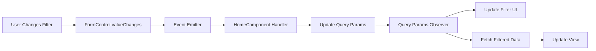

The Paginator application uses a reactive filtering system that seamlessly integrates with Angular's Reactive Forms and query parameters. This guide shows you how the filtering system works and how to use it effectively.

## How Filtering Works

The filtering system consists of three main components:

1. **FiltersComponent** - Provides the UI controls for filtering
2. **HomeComponent** - Orchestrates filter changes and data updates
3. **Query Parameters** - Persist filter state in the URL

## Filter Component Architecture

The `FiltersComponent` (`src/app/features/paginator/components/filters/filters.component.ts:1`) uses Reactive Forms to manage filter state:

```typescript
export class FiltersComponent implements OnInit {
  @Input() states: State[] = [];
  @Output() stateChanged = new EventEmitter<string | null>();
  @Output() pageSizeChanged = new EventEmitter<number>();

  stateControl = new FormControl('');
  pageSizeControl = new FormControl<number>(10);

  ngOnInit(): void {
    this.stateControl.valueChanges.subscribe(value => {
      this.stateChanged.emit(value ?? null);
    });

    this.pageSizeControl.valueChanges.subscribe(value => {
      if (value != null) {
        this.pageSizeChanged.emit(value);
      }
    });
  }
}
```

### Key Features

- **Reactive Forms**: Uses `FormControl` for each filter
- **Event Emitters**: Emits changes to parent component
- **Null Handling**: Properly handles empty state selections
- **Type Safety**: Strong typing with TypeScript

## Implementing Filters

<Steps>
  <Step title="Add the Filters Component">
    In your template, add the filters component with required inputs and outputs:

    ```html
    <app-filters 
        [states]="states" 
        (stateChanged)="onStateChanged($event)"
        (pageSizeChanged)="onPageSizeChanged($event)">
    </app-filters>
    ```
  </Step>

  <Step title="Handle State Changes">
    Implement the event handlers that update query parameters (`home.component.ts:94`):

    ```typescript
    onStateChanged(state: string | null): void {
      const currentQueryParams = { ...this.route.snapshot.queryParams };
      this.router.navigate([], {
        queryParams: {
          ...currentQueryParams,
          state: state || null,
          page: 1  // Reset to first page when filter changes
        },
        queryParamsHandling: 'merge'
      });
    }

    onPageSizeChanged(pageSize: number): void {
      const currentQueryParams = { ...this.route.snapshot.queryParams };
      this.router.navigate([], {
        queryParams: {
          ...currentQueryParams,
          pageSize,
          page: 1  // Reset to first page when page size changes
        },
        queryParamsHandling: 'merge'
      });
    }
    ```
  </Step>

  <Step title="Watch Query Parameters">
    Subscribe to query parameter changes to fetch filtered data (`home.component.ts:53`):

    ```typescript
    private watchQueryParams(): void {
      this.route.queryParams.subscribe(params => {
        const state = params['state'] || null;
        const pageSize = params['pageSize'] ? +params['pageSize'] : 10;
        const page = params['page'] ? +params['page'] : 1;

        // Update filter UI
        this.filtersComponent?.initFromQueryParams(state, pageSize);

        // Fetch filtered data
        this.getCities({ state, pageSize, page });
      });
    }
    ```
  </Step>

  <Step title="Fetch Filtered Data">
    Make API calls with the filter parameters (`home.component.ts:67`):

    ```typescript
    private getCities(filters: CityFilters): void {
      this.locationService.getCities(filters).subscribe({
        next: resp => {
          if (resp.success) {
            this.cities = resp.data;
            this.pagination = resp.pagination;
          }
        },
        error: err => console.error('Error fetching cities', err)
      });
    }
    ```
  </Step>
</Steps>

## Filter Initialization from Query Params

The `initFromQueryParams` method (`filters.component.ts:34`) synchronizes the UI with URL state:

```typescript
initFromQueryParams(state: string | null, pageSize: number) {
  this.stateControl.setValue(state ?? '', { emitEvent: false });
  this.pageSizeControl.setValue(pageSize ?? 10, { emitEvent: false });
}
```

<Note>
The `{ emitEvent: false }` option prevents triggering change events during initialization, avoiding unnecessary API calls.
</Note>

## Filter Data Flow

Here's how data flows through the filtering system:



## Filter Types

The `CityFilters` interface (`types/location.ts:37`) defines available filters:

```typescript
export interface CityFilters {
  state?: string;
  pageSize?: number;
  page?: number;
}
```

### State Filter

- **Type**: String or null
- **Purpose**: Filter cities by state
- **Default**: null (shows all states)
- **UI Control**: Select dropdown

### Page Size Filter

- **Type**: Number
- **Purpose**: Control number of items per page
- **Default**: 10
- **Options**: 10, 20
- **UI Control**: Select dropdown

## Service Integration

The `LocationsService` (`locations.service.ts:21`) converts filters to HTTP parameters:

```typescript
getCities(filters: CityFilters): Observable<CitiesResponse> {
  let params = new HttpParams();

  if (filters.state) {
    params = params.set('state', filters.state);
  }

  if (filters.pageSize) {
    params = params.set('pageSize', filters.pageSize.toString());
  }

  if (filters.page) {
    params = params.set('page', filters.page.toString());
  }

  return this.http.get<CitiesResponse>(`${this.baseUrl}/cities`, { params });
}
```

## Best Practices

<AccordionGroup>
  <Accordion title="Reset Pagination on Filter Change">
    Always reset to page 1 when filters change to avoid showing empty results:

    ```typescript
    queryParams: {
      ...currentQueryParams,
      state: newState,
      page: 1  // Important!
    }
    ```
  </Accordion>

  <Accordion title="Use Query Parameter Merging">
    Use `queryParamsHandling: 'merge'` to preserve other parameters:

    ```typescript
    this.router.navigate([], {
      queryParams: { state: newState },
      queryParamsHandling: 'merge'
    });
    ```
  </Accordion>

  <Accordion title="Avoid Event Loops">
    Use `{ emitEvent: false }` when programmatically setting form values:

    ```typescript
    this.stateControl.setValue(value, { emitEvent: false });
    ```
  </Accordion>

  <Accordion title="Handle Null Values">
    Always handle null/empty filter values gracefully:

    ```typescript
    const state = params['state'] || null;
    this.stateChanged.emit(value ?? null);
    ```
  </Accordion>
</AccordionGroup>

## Next Steps

<CardGroup cols={2}>
  <Card title="Pagination" icon="list-ol" href="/guides/pagination">
    Learn how pagination integrates with filters
  </Card>
  <Card title="Query Parameters" icon="link" href="/guides/query-parameters">
    Deep dive into URL state management
  </Card>
</CardGroup>