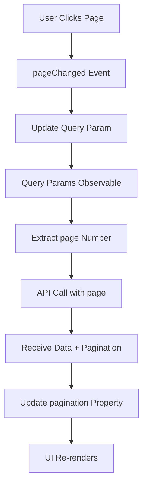

The Paginator application provides a robust pagination system that works seamlessly with filters and maintains state through URL query parameters. This guide explains how the pagination system works and how to use it effectively.

## How Pagination Works

Pagination in this application involves three key components:

1. **PaginationComponent** - Renders the pagination UI
2. **HomeComponent** - Manages pagination state and navigation
3. **Backend API** - Returns paginated data with metadata

## Pagination Component

The `PaginationComponent` (`src/app/features/paginator/components/pagination/pagination.component.ts:1`) is a reusable component that displays page navigation:

```typescript
export class PaginationComponent {
  @Input() pagination!: Pagination;
  @Output() pageChanged = new EventEmitter<number>();

  get pages(): number[] {
    if (!this.pagination?.totalPages) return [];
    const { currentPage, totalPages } = this.pagination;

    // Show a limited range of pages (e.g., +-2)
    const start = Math.max(1, currentPage - 2);
    const end = Math.min(totalPages, currentPage + 2);
    const range: number[] = [];
    for (let i = start; i <= end; i++) range.push(i);
    return range;
  }

  changePage(page: number): void {
    if (page < 1 || page > this.pagination.totalPages || page === this.pagination.currentPage) return;
    this.pageChanged.emit(page);
  }
}
```

### Key Features

- **Smart Page Range**: Shows current page ±2 pages for better UX
- **Boundary Validation**: Prevents invalid page navigation
- **No Duplicate Events**: Skips emission if already on the requested page

## Pagination Data Structure

The `Pagination` interface (`types/location.ts:14`) defines the pagination metadata:

```typescript
export interface Pagination {
  total: number;          // Total number of records
  totalPages: number;     // Total number of pages
  currentPage: number;    // Current active page (1-based)
  pageSize: number;       // Number of records per page
}
```

## Implementing Pagination

<Steps>
  <Step title="Add Pagination Component to Template">
    Include the pagination component in your template (`home.component.html:9`):

    ```html
    <app-pagination 
        *ngIf="pagination" 
        [pagination]="pagination" 
        (pageChanged)="onPageChanged($event)">
    </app-pagination>
    ```

    <Note>
    The `*ngIf="pagination"` guard ensures the component only renders after data is loaded.
    </Note>
  </Step>

  <Step title="Handle Page Change Events">
    Implement the page change handler that updates query parameters (`home.component.ts:118`):

    ```typescript
    onPageChanged(page: number): void {
      const currentQueryParams = { ...this.route.snapshot.queryParams };
      this.router.navigate([], {
        queryParams: {
          ...currentQueryParams,
          page
        },
        queryParamsHandling: 'merge'
      });
    }
    ```
  </Step>

  <Step title="Subscribe to Query Parameter Changes">
    Watch for query parameter changes and fetch paginated data (`home.component.ts:53`):

    ```typescript
    private watchQueryParams(): void {
      this.route.queryParams.subscribe(params => {
        const state = params['state'] || null;
        const pageSize = params['pageSize'] ? +params['pageSize'] : 10;
        const page = params['page'] ? +params['page'] : 1;

        // Update filters UI
        this.filtersComponent?.initFromQueryParams(state, pageSize);

        // Fetch paginated data
        this.getCities({ state, pageSize, page });
      });
    }
    ```
  </Step>

  <Step title="Fetch Data and Update Pagination State">
    Retrieve data and extract pagination metadata (`home.component.ts:67`):

    ```typescript
    private getCities(filters: CityFilters): void {
      this.locationService.getCities(filters).subscribe({
        next: resp => {
          if (resp.success) {
            this.cities = resp.data;
            this.pagination = resp.pagination;  // Update pagination metadata
          } else {
            console.warn('Backend message:', resp.message);
          }
        },
        error: err => console.error('Error fetching cities', err)
      });
    }
    ```
  </Step>
</Steps>

## Page Size Selection

Page size is controlled through the filters component but directly impacts pagination:

```typescript
onPageSizeChanged(pageSize: number): void {
  const currentQueryParams = { ...this.route.snapshot.queryParams };
  this.router.navigate([], {
    queryParams: {
      ...currentQueryParams,
      pageSize,
      page: 1  // Reset to first page when changing page size
    },
    queryParamsHandling: 'merge'
  });
}
```

<Warning>
Always reset to page 1 when changing page size to avoid requesting a page that doesn't exist with the new page size.
</Warning>

## Pagination Flow

Here's how pagination state flows through the application:



## Smart Page Range Calculation

The `pages` getter (`pagination.component.ts:15`) calculates which page numbers to display:

```typescript
get pages(): number[] {
  if (!this.pagination?.totalPages) return [];
  const { currentPage, totalPages } = this.pagination;

  // Show current page ±2 pages
  const start = Math.max(1, currentPage - 2);
  const end = Math.min(totalPages, currentPage + 2);
  
  const range: number[] = [];
  for (let i = start; i <= end; i++) range.push(i);
  return range;
}
```

### Examples

| Current Page | Total Pages | Pages Shown |
|--------------|-------------|-------------|
| 1            | 10          | [1, 2, 3]   |
| 5            | 10          | [3, 4, 5, 6, 7] |
| 10           | 10          | [8, 9, 10]  |

## Validation and Safety

The `changePage` method (`pagination.component.ts:27`) includes multiple safety checks:

```typescript
changePage(page: number): void {
  // Don't navigate if:
  if (page < 1 ||                              // Page is below minimum
      page > this.pagination.totalPages ||     // Page exceeds maximum
      page === this.pagination.currentPage)    // Already on this page
    return;
  
  this.pageChanged.emit(page);
}
```

## Initial Page Load

On component initialization (`home.component.ts:41`), pagination parameters are extracted from query params:

```typescript
ngAfterViewInit(): void {
  const state = this.initialQueryParams?.state || null;
  const pageSize = this.initialQueryParams?.pageSize ? +this.initialQueryParams.pageSize : 10;
  const page = this.initialQueryParams?.page ? +this.initialQueryParams.page : 1;

  // Initialize filters
  this.filtersComponent.initFromQueryParams(state, pageSize);

  // Fetch initial data
  this.getCities({ state, pageSize, page });
}
```

## API Response Structure

The backend returns paginated data in this format (`types/location.ts:21`):

```typescript
export interface CitiesResponse {
  status: number;
  success: boolean;
  message: string;
  totalRecords: number;
  data: City[];           // Current page data
  pagination: Pagination; // Pagination metadata
}
```

## Best Practices

<AccordionGroup>
  <Accordion title="Always Validate Page Boundaries">
    Prevent invalid page navigation:

    ```typescript
    if (page < 1 || page > totalPages) return;
    ```
  </Accordion>

  <Accordion title="Reset to Page 1 on Filter Changes">
    When filters change, reset pagination:

    ```typescript
    onStateChanged(state: string | null): void {
      this.router.navigate([], {
        queryParams: { state, page: 1 }
      });
    }
    ```
  </Accordion>

  <Accordion title="Show Limited Page Range">
    Don't display all pages if there are many:

    ```typescript
    // Show ±2 pages instead of all pages
    const start = Math.max(1, currentPage - 2);
    const end = Math.min(totalPages, currentPage + 2);
    ```
  </Accordion>

  <Accordion title="Use Query Parameters for State">
    Store pagination state in URL for bookmarking and sharing:

    ```typescript
    queryParams: { page, pageSize }
    ```
  </Accordion>

  <Accordion title="Guard Against Missing Data">
    Use `*ngIf` to prevent rendering before data loads:

    ```html
    <app-pagination *ngIf="pagination" [pagination]="pagination">
    </app-pagination>
    ```
  </Accordion>
</AccordionGroup>

## Integration with Filters

Pagination and filters work together seamlessly. When any filter changes, pagination automatically resets to page 1:

```typescript
// State filter changes
onStateChanged(state: string | null): void {
  queryParams: { state, page: 1 }  // Reset pagination
}

// Page size changes
onPageSizeChanged(pageSize: number): void {
  queryParams: { pageSize, page: 1 }  // Reset pagination
}

// Only page navigation preserves current filters
onPageChanged(page: number): void {
  queryParams: { ...currentQueryParams, page }  // Keep all filters
}
```

## Next Steps

<CardGroup cols={2}>
  <Card title="Filtering Data" icon="filter" href="/guides/filtering-data">
    Learn how filters integrate with pagination
  </Card>
  <Card title="Query Parameters" icon="link" href="/guides/query-parameters">
    Understand URL-based state management
  </Card>
</CardGroup>