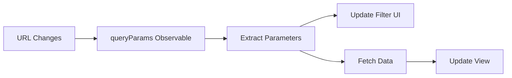

The Paginator application uses URL query parameters as the single source of truth for application state. This approach enables bookmarking, sharing, and browser navigation while keeping the UI in sync with the URL.

## Overview

Query parameters drive the entire application state, including:

- **state**: Selected state filter
- **pageSize**: Number of records per page (10 or 20)
- **page**: Current page number

## Why Query Parameters?

Using query parameters for state management provides several benefits:

<CardGroup cols={2}>
  <Card title="Bookmarkable" icon="bookmark">
    Users can bookmark specific filter/page combinations
  </Card>
  <Card title="Shareable" icon="share">
    URLs can be shared to show exact same view
  </Card>
  <Card title="Browser Navigation" icon="arrow-left">
    Back/forward buttons work as expected
  </Card>
  <Card title="State Persistence" icon="floppy-disk">
    Page refresh preserves current state
  </Card>
</CardGroup>

## Query Parameter Structure

The application uses these query parameters:

| Parameter | Type | Default | Description |
|-----------|------|---------|-------------|
| `state` | string \| null | null | State ID to filter cities |
| `pageSize` | number | 10 | Records per page (10 or 20) |
| `page` | number | 1 | Current page number |

### Example URLs

```
# Show all cities, 10 per page, page 1 (defaults)
http://localhost:4200/

# Filter by California, 20 per page, page 3
http://localhost:4200/?state=06&pageSize=20&page=3

# Show all cities, 10 per page, page 5
http://localhost:4200/?page=5
```

## Reading Query Parameters

The `HomeComponent` reads query parameters in multiple lifecycle hooks:

### On Component Initialization

(`home.component.ts:32`)

```typescript
ngOnInit(): void {
  this.getStates();
  this.watchQueryParams();

  // Store initial query params for use in AfterViewInit
  this.route.queryParams.subscribe(params => {
    this.initialQueryParams = params;
  });
}
```

### After View Initialization

(`home.component.ts:41`)

```typescript
ngAfterViewInit(): void {
  // Extract parameters with defaults
  const state = this.initialQueryParams?.state || null;
  const pageSize = this.initialQueryParams?.pageSize ? +this.initialQueryParams.pageSize : 10;
  const page = this.initialQueryParams?.page ? +this.initialQueryParams.page : 1;

  // Initialize filters from URL
  this.filtersComponent.initFromQueryParams(state, pageSize);

  // Fetch data based on URL parameters
  this.getCities({ state, pageSize, page });
}
```

<Note>
The `+` operator converts string query params to numbers: `+params.pageSize`
</Note>

## Watching Query Parameter Changes

The `watchQueryParams()` method (`home.component.ts:53`) subscribes to query parameter changes:

```typescript
private watchQueryParams(): void {
  this.route.queryParams.subscribe(params => {
    // Extract with defaults
    const state = params['state'] || null;
    const pageSize = params['pageSize'] ? +params['pageSize'] : 10;
    const page = params['page'] ? +params['page'] : 1;

    // Update filter UI to match URL
    this.filtersComponent?.initFromQueryParams(state, pageSize);

    // Fetch data whenever any parameter changes
    this.getCities({ state, pageSize, page });
  });
}
```

### Data Flow



## Updating Query Parameters

The application updates query parameters through Angular's Router:

### When State Filter Changes

(`home.component.ts:94`)

```typescript
onStateChanged(state: string | null): void {
  const currentQueryParams = { ...this.route.snapshot.queryParams };
  this.router.navigate([], {
    queryParams: {
      ...currentQueryParams,
      state: state || null,
      page: 1  // Reset to first page
    },
    queryParamsHandling: 'merge'
  });
}
```

### When Page Size Changes

(`home.component.ts:106`)

```typescript
onPageSizeChanged(pageSize: number): void {
  const currentQueryParams = { ...this.route.snapshot.queryParams };
  this.router.navigate([], {
    queryParams: {
      ...currentQueryParams,
      pageSize,
      page: 1  // Reset to first page
    },
    queryParamsHandling: 'merge'
  });
}
```

### When Page Changes

(`home.component.ts:118`)

```typescript
onPageChanged(page: number): void {
  const currentQueryParams = { ...this.route.snapshot.queryParams };
  this.router.navigate([], {
    queryParams: {
      ...currentQueryParams,
      page
    },
    queryParamsHandling: 'merge'
  });
}
```

## Key Patterns

### Preserve Existing Parameters

Always spread existing query params to preserve other parameters:

```typescript
const currentQueryParams = { ...this.route.snapshot.queryParams };
this.router.navigate([], {
  queryParams: {
    ...currentQueryParams,  // Keep other params
    page: newPage           // Update specific param
  }
});
```

### Use Query Params Handling

Use `queryParamsHandling: 'merge'` to merge with existing params:

```typescript
this.router.navigate([], {
  queryParams: { state: newState },
  queryParamsHandling: 'merge'  // Merge with existing
});
```

### Reset Pagination on Filter Changes

Always reset to page 1 when filters change:

```typescript
queryParams: {
  ...currentQueryParams,
  state: newState,
  page: 1  // Important!
}
```

### Convert Strings to Numbers

Query parameters are always strings, convert when needed:

```typescript
const pageSize = params['pageSize'] ? +params['pageSize'] : 10;
const page = params['page'] ? +params['page'] : 1;
```

## Complete Flow Example

Here's the complete flow when a user changes the state filter:

<Steps>
  <Step title="User Selects State">
    User selects "California" in the dropdown.
  </Step>

  <Step title="Form Control Emits Change">
    The `stateControl.valueChanges` observable emits the new value (`filters.component.ts:23`):

    ```typescript
    this.stateControl.valueChanges.subscribe(value => {
      this.stateChanged.emit(value ?? null);
    });
    ```
  </Step>

  <Step title="Parent Handler Updates URL">
    The `onStateChanged` handler updates query parameters (`home.component.ts:94`):

    ```typescript
    onStateChanged(state: string | null): void {
      this.router.navigate([], {
        queryParams: { state, page: 1 }
      });
    }
    ```
  </Step>

  <Step title="URL Changes">
    Browser URL updates to: `?state=06&pageSize=10&page=1`
  </Step>

  <Step title="Query Params Observable Fires">
    The `watchQueryParams` subscription receives the new params (`home.component.ts:53`):

    ```typescript
    this.route.queryParams.subscribe(params => {
      const state = params['state'] || null;
      // ...
    });
    ```
  </Step>

  <Step title="UI Syncs with URL">
    Filters component updates to match URL:

    ```typescript
    this.filtersComponent?.initFromQueryParams(state, pageSize);
    ```
  </Step>

  <Step title="Data Fetches">
    New data is fetched with the updated parameters:

    ```typescript
    this.getCities({ state, pageSize, page });
    ```
  </Step>

  <Step title="View Updates">
    The component renders the filtered data.
  </Step>
</Steps>

## Avoiding Infinite Loops

When initializing form controls from query params, use `{ emitEvent: false }`:

```typescript
initFromQueryParams(state: string | null, pageSize: number) {
  // Don't emit events during initialization
  this.stateControl.setValue(state ?? '', { emitEvent: false });
  this.pageSizeControl.setValue(pageSize ?? 10, { emitEvent: false });
}
```

<Warning>
Without `{ emitEvent: false }`, setting form values would trigger `valueChanges`, which would update query params, which would trigger `queryParams` subscription, creating an infinite loop.
</Warning>

## Type Safety

The `CityFilters` interface (`types/location.ts:37`) ensures type safety:

```typescript
export interface CityFilters {
  state?: string;
  pageSize?: number;
  page?: number;
}

private getCities(filters: CityFilters): void {
  this.locationService.getCities(filters).subscribe(/* ... */);
}
```

## Best Practices

<AccordionGroup>
  <Accordion title="Always Provide Defaults">
    Always provide default values when reading query parameters:

    ```typescript
    const page = params['page'] ? +params['page'] : 1;
    const pageSize = params['pageSize'] ? +params['pageSize'] : 10;
    ```
  </Accordion>

  <Accordion title="Preserve Existing Parameters">
    Spread existing query params when updating:

    ```typescript
    const currentQueryParams = { ...this.route.snapshot.queryParams };
    queryParams: { ...currentQueryParams, page: newPage }
    ```
  </Accordion>

  <Accordion title="Reset Pagination on Filters">
    Always reset to page 1 when any filter changes:

    ```typescript
    queryParams: { state: newState, page: 1 }
    ```
  </Accordion>

  <Accordion title="Use Merge Strategy">
    Use `queryParamsHandling: 'merge'` to preserve other parameters:

    ```typescript
    this.router.navigate([], {
      queryParams: { page },
      queryParamsHandling: 'merge'
    });
    ```
  </Accordion>

  <Accordion title="Convert Types Explicitly">
    Query params are strings, convert explicitly:

    ```typescript
    const page = +params['page'];  // Convert to number
    ```
  </Accordion>

  <Accordion title="Prevent Event Loops">
    Use `{ emitEvent: false }` when syncing UI with URL:

    ```typescript
    this.control.setValue(value, { emitEvent: false });
    ```
  </Accordion>
</AccordionGroup>

## Testing Query Parameters

You can manually test query parameters by editing the URL:

```
# Test different states
http://localhost:4200/?state=06
http://localhost:4200/?state=36

# Test different page sizes
http://localhost:4200/?pageSize=20

# Test different pages
http://localhost:4200/?page=5

# Test combinations
http://localhost:4200/?state=06&pageSize=20&page=3

# Test edge cases
http://localhost:4200/?page=999  # Should handle gracefully
http://localhost:4200/?pageSize=50  # Should default to 10 or 20
```

## Debugging Query Parameters

Add logging to track query parameter changes:

```typescript
private watchQueryParams(): void {
  this.route.queryParams.subscribe(params => {
    console.log('Query params changed:', params);
    
    const state = params['state'] || null;
    const pageSize = params['pageSize'] ? +params['pageSize'] : 10;
    const page = params['page'] ? +params['page'] : 1;
    
    console.log('Parsed values:', { state, pageSize, page });
    
    this.getCities({ state, pageSize, page });
  });
}
```

## Next Steps

<CardGroup cols={2}>
  <Card title="Filtering Data" icon="filter" href="/guides/filtering-data">
    Learn how filters integrate with query parameters
  </Card>
  <Card title="Pagination" icon="list-ol" href="/guides/pagination">
    Understand how pagination uses query parameters
  </Card>
</CardGroup>